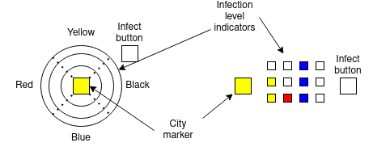

# Pandemic

A project to create an electronic [pandemic](https://boardgamegeek.com/boardgame/30549/pandemic) board, that can be used with the rest of the board game.
It'll feature things like:

- LEDs showing infection levels of cities
- semi-automatic spread of diseases between cities

### Plan

Each city will show its current infection level using a collection of programable LEDs.
There will be one button per city that can be used to trigger interactions (injection, cleanup, etc) with that city.
When pressed, a connected arduino will calculate the effects of the interaction and update the infection levels of all cities.

There will also be "global" buttons, not associated with a given city, that the kind of interaction that takes place in a city when its button is pressed.
For example, a button that toggles between "clear" and "infection" modes.

To simulate the effect of the Quarantine specialist, cities will also need to support a "switch" that can have a Meeple placed on it, allowing the Arduino to know which city the Quarantine specialist is in.

## Stage 1 - small set of connected LEDs

Arduino connected to a few programable LEDs, each representing a city, and one button per city.
Pressing a button lights up it's city and any adjacent ones.
